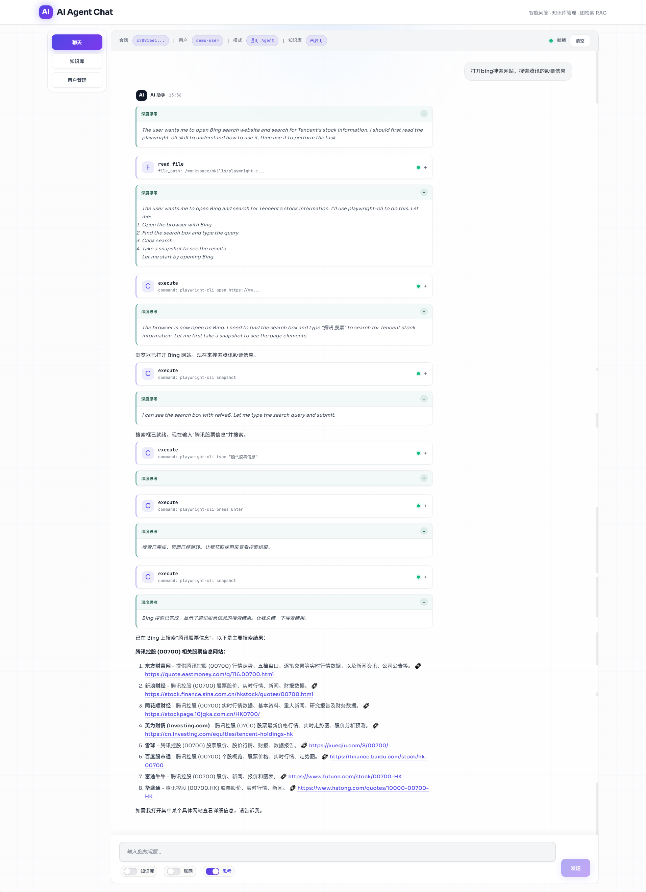

# LangChain Agent API

基于 FastAPI + LangGraph 的智能 Agent API 服务，支持 RAG 知识库、工具调用、流式输出和多种执行后端。

## 功能特性

- **Agent 系统**：基于 LangGraph 的 DeepAgent/ReactAgent，支持本地 Shell、Store 和 Sandbox 三种执行后端
- **RAG 知识库**：基于 Elasticsearch 的向量检索 + 知识图谱 RAG，支持文档上传和智能问答
- **工具生态**：内置天气查询、网页抓取、定时任务等工具，支持 MCP 协议扩展
- **流式输出**：SSE 实时流式返回，支持 AG-UI 协议
- **前端界面**：Next.js + React 构建的交互式聊天界面
- **可观测性**：集成 Phoenix tracing，支持 LangSmith

## 界面预览



## 项目结构
```
langchain-api/
├── langchain_api/          # 后端核心
│   ├── agent/              # Agent 系统
│   ├── api/                # API 路由层
│   ├── middleware/         # 中间件（业务开关、工具搜索、沙箱）
│   ├── rag/                # RAG 检索系统
│   ├── tools/              # 内置工具
│   ├── main.py             # FastAPI 入口
│   └── settings.py         # 配置管理
├── frontend/              # Next.js 前端
│   ├── app/                # 页面路由
│   └── components/         # React 组件
├── .langchain_api/         # 工作区（技能、文件）
└── docker-compose.yml      # 可选服务（Phoenix）
```

## 快速开始

### 1. 环境准备

```bash
# Python 3.12+
# Node.js 18+
# Elasticsearch 8.x
```

### 2. 后端初始化

```bash
# 复制环境变量配置
cp .env.example .env

# 编辑 .env 填入必要配置
# OPENAI_API_BASE=https://api.openai.com/v1
# OPENAI_API_KEY=your-api-key
# CHAT_MODEL_NAME=qwen3
# EMBEDDING_MODEL_NAME=qwen3-embedding
# ES_URL=http://localhost:9200

# 安装依赖
uv sync --dev
```

### 3. 启动服务

```bash
# 启动后端（默认端口 7869）
uv run uvicorn langchain_api.main:app --reload --host 0.0.0.0 --port 7869

# 或直接运行
uv run python -m langchain_api.main
```

### 4. 前端开发（可选）

```bash
cd frontend
pnpm install
pnpm dev      # 开发模式 http://localhost:3000
pnpm build    # 构建静态文件
```

前端构建后会自动部署到后端，通过 `http://localhost:7869/` 访问。

## API 接口

### Agent 接口

| 接口 | 协议 | 用途 |
|------|------|------|
| `POST /api/agent/ag_ui` | AG-UI | Agent 交互界面 |
| `POST /api/agent/general_api` | SSE | 通用流式接口 |

### RAG 接口

| 接口 | 协议 | 用途 |
|------|------|------|
| `POST /api/rag/general_api` | SSE | RAG 流式问答 |
| `POST /api/rag/management/upload` | REST | 上传文档 |
| `GET /api/rag/management/knowledge_bases` | REST | 获取知识库列表 |
| `DELETE /api/rag/management/documents/{doc_id}` | REST | 删除文档 |

## 配置说明

### 必填环境变量

| 变量 | 说明 |
|------|------|
| `OPENAI_API_BASE` | LLM API 地址 |
| `OPENAI_API_KEY` | LLM API 密钥 |
| `CHAT_MODEL_NAME` | 聊天模型名称（如 `qwen3`） |
| `EMBEDDING_MODEL_NAME` | 向量模型名称（如 `qwen3-embedding`） |
| `ES_URL` / `ES_URSR` / `ES_PWD` | Elasticsearch 连接配置 |

### 可选环境变量

| 变量 | 默认值 | 说明 |
|------|--------|------|
| `BACKEND_TYPE` | `local_shell` | 执行后端：`local_shell`/`store`/`sandbox` |
| `TAVILY_API_KEY` | - | 启用联网搜索 |
| `PG_DATABASE_URL` | - | Postgres 持久化记忆 |
| `USE_TOOL_SEARCH` | `False` | 启用延迟工具加载 |
| `USE_COPILOTKIT` | `False` | 启用 CopilotKit |
| `PHOENIX_COLLECTOR_ENDPOINT` | - | 启用 Phoenix tracing |

## RAG 知识库

### 功能特性

- **向量检索**：Dense Vector + BM25 混合检索
- **知识图谱**：自动抽取实体和关系，构建三元组索引
- **图扩展**：基于实体关系进行图传播召回
- **文档管理**：支持 PDF、TXT 等格式上传和 chunk 管理

### 工作原理

```
用户查询 → 实体抽取 → 向量/图检索 → 关系扩展 → 上下文组装 → LLM 生成
```

### 管理接口

```bash
# 上传知识库文档
curl -X POST http://localhost:7869/api/rag/management/upload \
  -F "files=@document.pdf" \
  -F "knowledge_base_id=kb-001"

# 列出知识库
curl http://localhost:7869/api/rag/management/knowledge_bases

# 删除文档
curl -X DELETE http://localhost:7869/api/rag/management/documents/{doc_id}
```

## Agent 工具

### 内置工具

| 工具 | 说明 |
|------|------|
| `weather` | 天气查询 |
| `web_fetch` | 网页内容抓取 |
| `cron_manager` | 定时任务管理 |

### 工具搜索

启用 `USE_TOOL_SEARCH=True` 后，Agent 会根据任务需求动态搜索可用工具，提升工具调用效率。

### MCP 扩展

支持通过 LangChain MCP Adapters 接入外部工具服务。

## Sandbox 后端

使用 OpenSandbox 实现代码执行沙箱：

```bash
# 配置 .sandbox.toml
opensandbox-server --config .sandbox.toml

# 安装 Playwright
playwright install --with-deps chromium
```

## 可观测性

### Phoenix Tracing

```bash
# 启动 Phoenix
docker-compose up -d phoenix

# 访问 http://localhost:6006 查看 traces
```

## 开发指南

### 代码检查

```bash
# Python 语法检查
uv run python -m py_compile <file.py>

# 前端 lint
cd frontend && pnpm lint
```

### 工作区目录

`.langchain_api/workspace` 用于存放：
- `skills/`：自定义技能定义
- `pdf_files/`：上传的文档
- `converted_pdf/`：转换后的文本

## 依赖技术

- **后端**：FastAPI, LangGraph, DeepAgents, Elasticsearch
- **前端**：Next.js, React, TypeScript
- **向量存储**：Elasticsearch
- **持久化**：PostgreSQL (可选)
- **可观测性**：Phoenix, LangSmith

## License

MIT